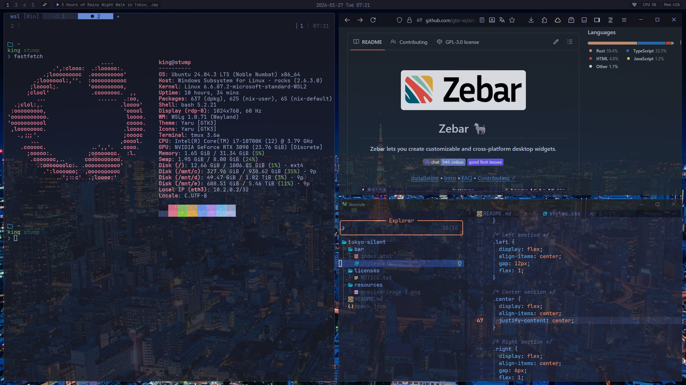

# Tokyo Silence

Tokyo Silence is a theme inspired by the quiet stillness of Tokyo Night.



## Features

- Thin, low-contrast bar designed to stay out of the way.
- GlazeWM workspaces and tiling direction indicator.
- Media title marquee with hover-only scroll and pause-aware behavior.
- CPU/Mem/Battery/Network indicators.

## Install

## Requirements

- Zebar 3.2.0 or later

1) Copy this folder to your Zebar packs directory, or clone the repo.
2) Point your Zebar settings to this pack:

```json
{
  "startupConfigs": [
    {
      "pack": "tokyo-silence",
      "widget": "bar",
      "preset": "default"
    }
  ]
}
```

## Customization

- Bar height: `--bar-item-height` in `bar/styles.css`
- Marquee speed/gap: `--marquee-speed` / `--marquee-gap` in `bar/styles.css`
- Colors: `:root` variables in `bar/styles.css`

## Publish

1) Ensure you have a Zebar API token from glzr.io/api-token.
2) From the pack root, run:

```bash
zebar publish --token your-api-token
```

## License

MIT. See `LICENSE`.

Fonts are loaded via CDN; no font files are redistributed. See `licenses/NOTICE.txt`.
